# gRPC Proto 협업 워크플로우 설계

## 📋 목차

- [개요](#개요)
- [현재 상황 분석](#현재-상황-분석)
- [제안하는 솔루션](#제안하는-솔루션)
- [아키텍처 설계](#아키텍처-설계)
- [브랜치 전략](#브랜치-전략)
- [권한 관리](#권한-관리)
- [CLI 도구 개선안](#cli-도구-개선안)
- [구현 로드맵](#구현-로드맵)

---

## 개요

### 목적
각 서비스 팀이 gRPC proto 파일을 효율적으로 협업하고 관리할 수 있는 통합 워크플로우 구축

### 핵심 요구사항
1. **중앙 집중식 Proto 관리**: grpc-protos 저장소를 단일 진실 소스(Single Source of Truth)로 활용
2. **유연한 개발 환경**: 각 서비스 팀이 전체 proto 컨텍스트를 확인하며 작업
3. **역할 기반 권한**: gRPC 서버 팀은 직접 수정, 클라이언트 팀은 PR 제출
4. **CLI 도구 통합**: mysingle-protos 패키지 설치 시 오케스트레이터 자동 제공

---

## 현재 상황 분석

### 현재 워크플로우

```mermaid
graph TB
    subgraph "각 서비스 저장소"
        S1[strategy-service/protos/]
        S2[market-data-service/protos/]
        S3[backtest-service/protos/]
    end
    
    subgraph "grpc-protos 저장소"
        GP[grpc-protos/protos/]
        ORC[proto_orchestrator.py]
    end
    
    S1 -->|sync| GP
    S2 -->|sync| GP
    S3 -->|sync| GP
    GP -->|generate & publish| PKG[mysingle-protos@v2.0.4]
    PKG -->|pip install| S1
    PKG -->|pip install| S2
    PKG -->|pip install| S3
    
    style GP fill:#e1f5ff
    style PKG fill:#fff4e1
```

### 문제점
1. ❌ **제한된 컨텍스트**: 각 서비스는 자신의 proto만 보고 작업
2. ❌ **의존성 파악 어려움**: 다른 서비스의 proto 변경사항을 즉시 확인 불가
3. ❌ **협업 장벽**: gRPC 클라이언트가 서버 proto 변경 요청 시 별도 커뮤니케이션 필요
4. ❌ **도구 접근성**: orchestrator가 grpc-protos 저장소에 종속

---

## 제안하는 솔루션

### 새로운 워크플로우 개요

```mermaid
graph TB
    subgraph "개발자 로컬 환경"
        CLONE[grpc-protos 저장소 Clone]
        BRANCH[기능 브랜치 생성]
        EDIT[Proto 파일 수정]
        CLI[proto-cli 실행]
    end
    
    subgraph "grpc-protos 저장소 (GitHub)"
        MAIN[main 브랜치]
        DEV[dev 브랜치]
        FEAT[feature/* 브랜치들]
        
        MAIN -->|base| DEV
        DEV -->|base| FEAT
    end
    
    subgraph "권한 분기"
        SERVER{서버 팀?}
        DIRECT[직접 Push to dev]
        PR[Pull Request]
    end
    
    subgraph "CI/CD Pipeline"
        VALIDATE[검증: buf lint/breaking]
        GENERATE[코드 생성]
        TAG[버전 태그 생성]
        PUBLISH[패키지 배포]
    end
    
    CLONE --> BRANCH
    BRANCH --> EDIT
    EDIT --> CLI
    CLI --> SERVER
    
    SERVER -->|Yes| DIRECT
    SERVER -->|No| PR
    
    DIRECT --> DEV
    PR --> DEV
    
    DEV -->|merge to main| VALIDATE
    VALIDATE --> GENERATE
    GENERATE --> TAG
    TAG --> PUBLISH
    
    PUBLISH --> PKG[mysingle-protos@v2.x.x]
    PKG -->|pip install| SERVICES[모든 서비스]
    
    style MAIN fill:#90EE90
    style DEV fill:#87CEEB
    style PKG fill:#FFD700
```

---

## 아키텍처 설계

### 1. 저장소 구조 개선

```mermaid
graph LR
    subgraph "grpc-protos Repository"
        ROOT[/]
        
        subgraph "protos/"
            COMMON[common/]
            SERVICES[services/]
            
            subgraph "services/ 상세"
                STRAT[strategy/v1/]
                MARKET[market_data/v1/]
                INDIC[indicator/v1/]
            end
        end
        
        subgraph "scripts/"
            ORC[proto_orchestrator.py]
            ENTRY[__main__.py]
        end
        
        subgraph "generated/"
            PYTHON[mysingle_protos/]
        end
        
        CONFIG[pyproject.toml]
        OWNERS[CODEOWNERS]
        
        ROOT --> protos/
        ROOT --> scripts/
        ROOT --> generated/
        ROOT --> CONFIG
        ROOT --> OWNERS
    end
    
    style OWNERS fill:#FFE4E1
    style ENTRY fill:#E1FFE4
```

### 2. 패키지 진입점 설계

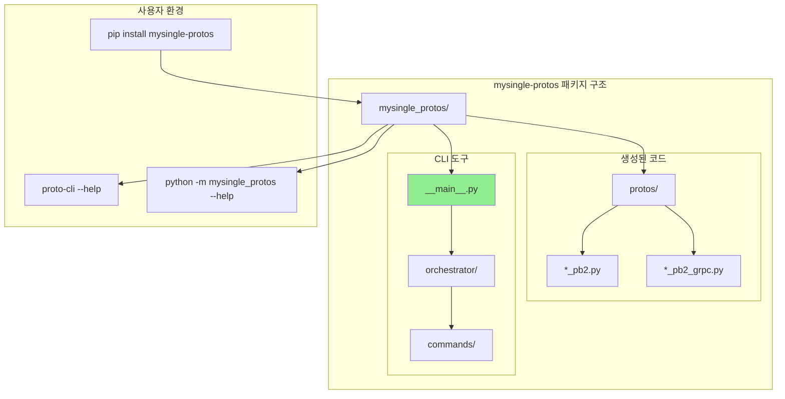

---

## 브랜치 전략

### Git Flow 기반 전략

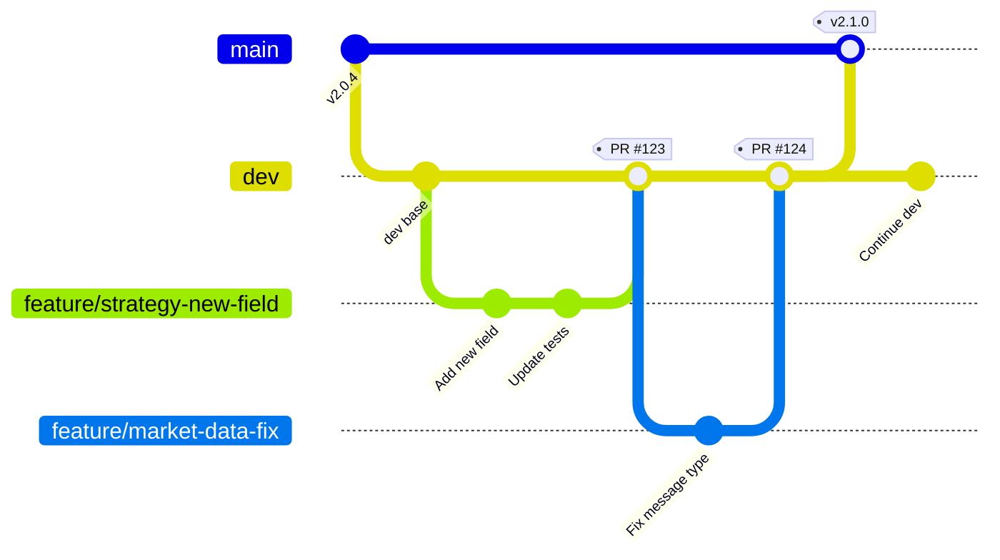

### 브랜치 규칙

| 브랜치      | 용도            | 보호 규칙        | 머지 조건                       |
| ----------- | --------------- | ---------------- | ------------------------------- |
| `main`      | 프로덕션 릴리즈 | ✅ Protected      | dev에서 PR + 승인 2명 + CI 통과 |
| `dev`       | 개발 통합       | ✅ Protected      | feature에서 PR + CI 통과        |
| `feature/*` | 기능 개발       | ❌                | 개발자 자유 작업                |
| `hotfix/*`  | 긴급 수정       | ⚠️ Semi-protected | main에서 직접 분기 가능         |

---

## 권한 관리

### CODEOWNERS 기반 권한 설정

```mermaid
graph TB
    subgraph "Proto 파일 소유권"
        COMMON[protos/common/*]
        STRATEGY[protos/services/strategy/*]
        MARKET[protos/services/market_data/*]
        INDICATOR[protos/services/indicator/*]
        GENAI[protos/services/genai/*]
    end
    
    subgraph "팀 권한"
        ADMIN[@team-platform-admin]
        STRATEGY_TEAM[@team-strategy]
        MARKET_TEAM[@team-market-data]
        INDICATOR_TEAM[@team-indicator]
        GENAI_TEAM[@team-genai]
    end
    
    COMMON --> ADMIN
    STRATEGY --> STRATEGY_TEAM
    STRATEGY --> ADMIN
    MARKET --> MARKET_TEAM
    MARKET --> ADMIN
    INDICATOR --> INDICATOR_TEAM
    INDICATOR --> ADMIN
    GENAI --> GENAI_TEAM
    GENAI --> ADMIN
    
    style ADMIN fill:#FF6B6B
    style STRATEGY_TEAM fill:#4ECDC4
    style MARKET_TEAM fill:#45B7D1
```

### CODEOWNERS 예시

```plaintext
# grpc-protos/.github/CODEOWNERS

# 기본 관리자
* @team-platform-admin

# Common protos (모든 변경은 플랫폼 팀 승인 필요)
/protos/common/ @team-platform-admin

# 서비스별 소유권 (해당 팀 + 플랫폼 팀)
/protos/services/strategy/ @team-strategy @team-platform-admin
/protos/services/market_data/ @team-market-data @team-platform-admin
/protos/services/indicator/ @team-indicator @team-platform-admin
/protos/services/genai/ @team-genai @team-platform-admin
/protos/services/ml/ @team-ml @team-platform-admin
/protos/services/backtest/ @team-backtest @team-platform-admin

# Scripts 및 CI (플랫폼 팀만)
/scripts/ @team-platform-admin
/.github/ @team-platform-admin
/buf.yaml @team-platform-admin
/buf.gen.yaml @team-platform-admin
```

### 권한 매트릭스

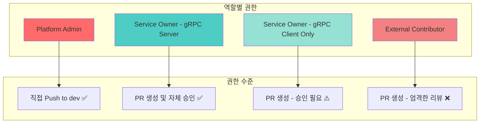

---

## CLI 도구 개선안

### 현재 vs 제안

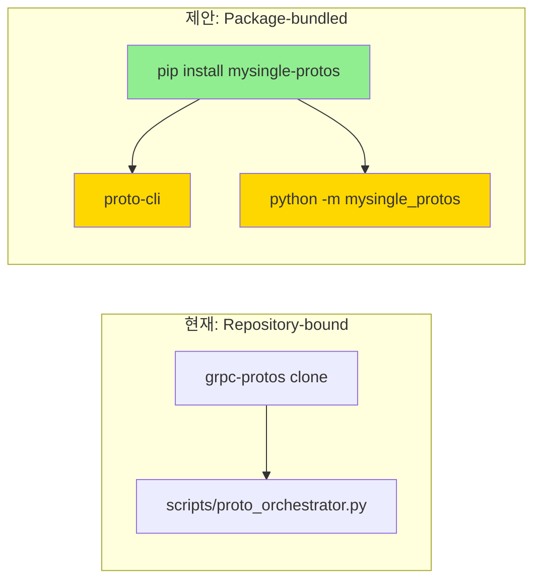

### 새로운 CLI 구조

```
mysingle_protos/
├── protos/                      # 생성된 proto 코드
│   ├── common/
│   └── services/
├── cli/                         # CLI 모듈 (새로 추가)
│   ├── __init__.py
│   ├── __main__.py             # 진입점
│   ├── orchestrator.py         # 기존 로직 리팩토링
│   ├── commands/
│   │   ├── init.py            # proto 저장소 clone/setup
│   │   ├── sync.py
│   │   ├── codegen.py
│   │   ├── release.py
│   │   ├── validate.py
│   │   └── contribute.py      # PR 생성 도우미
│   └── utils/
│       ├── git.py
│       ├── buf.py
│       └── github.py           # GitHub API 연동
└── __init__.py
```

### 새로운 CLI 명령어

```mermaid
graph TB
    CLI[proto-cli]
    
    subgraph "저장소 관리"
        INIT[init - grpc-protos 클론 및 설정]
        STATUS[status - 현재 상태 확인]
        SYNC[sync - 최신 변경사항 동기화]
    end
    
    subgraph "개발 작업"
        BRANCH[branch - 기능 브랜치 생성]
        EDIT[edit - proto 파일 편집 (에디터 실행)]
        VALIDATE[validate - 로컬 검증]
    end
    
    subgraph "배포 작업"
        CODEGEN[codegen - 코드 생성]
        PR[pr - Pull Request 생성]
        RELEASE[release - 버전 릴리즈 (권한자만)]
    end
    
    subgraph "협업 도구"
        DIFF[diff - 변경사항 비교]
        IMPACT[impact - 영향도 분석]
        OWNERS[owners - 소유자 확인]
    end
    
    CLI --> INIT
    CLI --> STATUS
    CLI --> SYNC
    CLI --> BRANCH
    CLI --> EDIT
    CLI --> VALIDATE
    CLI --> CODEGEN
    CLI --> PR
    CLI --> RELEASE
    CLI --> DIFF
    CLI --> IMPACT
    CLI --> OWNERS
    
    style CLI fill:#FFD700
    style INIT fill:#90EE90
    style PR fill:#87CEEB
```

### 사용 시나리오

#### 시나리오 1: gRPC 서버 팀의 Proto 업데이트

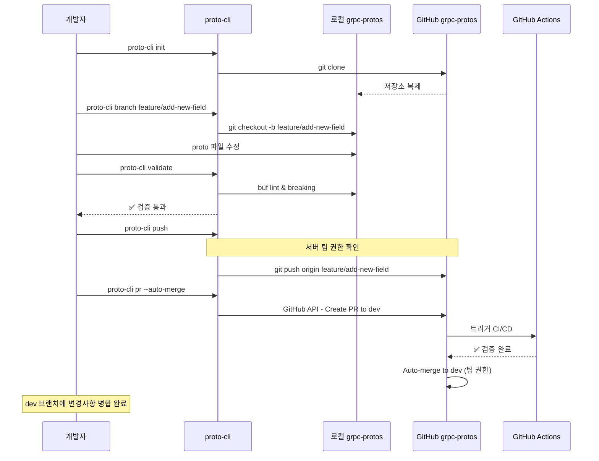

#### 시나리오 2: gRPC 클라이언트 팀의 변경 요청

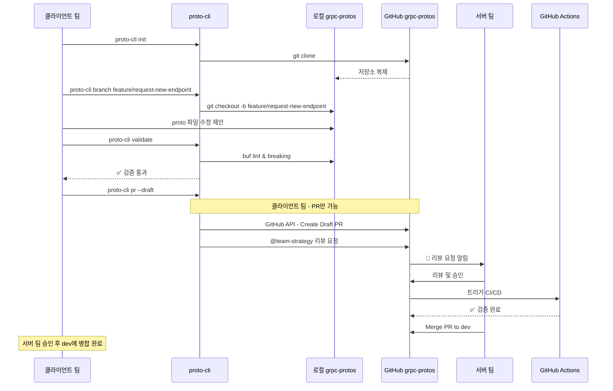

---

## 워크플로우 상세 설계

### 전체 프로세스

```mermaid
flowchart TB
    START([개발자 시작])
    
    subgraph SETUP["🔧 환경 설정"]
        INSTALL[pip install mysingle-protos]
        INIT[proto-cli init]
        CLONE{저장소 존재?}
        GIT_CLONE[git clone grpc-protos]
        GIT_PULL[git pull origin dev]
    end
    
    subgraph DEVELOP["💻 개발 작업"]
        CREATE_BRANCH[proto-cli branch feature/xxx]
        EDIT_PROTO[proto 파일 수정]
        VALIDATE_LOCAL[proto-cli validate]
        VALID{검증 통과?}
    end
    
    subgraph SUBMIT["📤 제출 프로세스"]
        CHECK_PERM{권한 확인}
        DIRECT_PUSH[proto-cli push --to-dev]
        CREATE_PR[proto-cli pr create]
        DRAFT{Draft PR?}
        REQUEST_REVIEW[리뷰어 지정]
    end
    
    subgraph REVIEW["👀 리뷰 프로세스"]
        AWAIT_REVIEW[리뷰 대기]
        CI_CHECK[CI/CD 검증]
        REVIEWER_CHECK[리뷰어 승인]
        APPROVED{승인?}
    end
    
    subgraph MERGE["🔀 병합 프로세스"]
        MERGE_DEV[dev 브랜치 병합]
        AUTO_VERSION[자동 버전 증가]
        WAIT_RELEASE[릴리즈 대기]
        MANUAL_RELEASE{수동 릴리즈?}
        RELEASE_CMD[proto-cli release --version x.y.z]
        AUTO_RELEASE[main 병합 시 자동 릴리즈]
    end
    
    subgraph PUBLISH["📦 배포"]
        GEN_CODE[Python stub 생성]
        RUN_TESTS[테스트 실행]
        CREATE_TAG[Git 태그 생성]
        PUBLISH_PKG[PyPI/GitHub Release 배포]
    end
    
    END([완료])
    
    START --> INSTALL
    INSTALL --> INIT
    INIT --> CLONE
    CLONE -->|No| GIT_CLONE
    CLONE -->|Yes| GIT_PULL
    GIT_CLONE --> CREATE_BRANCH
    GIT_PULL --> CREATE_BRANCH
    
    CREATE_BRANCH --> EDIT_PROTO
    EDIT_PROTO --> VALIDATE_LOCAL
    VALIDATE_LOCAL --> VALID
    VALID -->|Fail| EDIT_PROTO
    VALID -->|Pass| CHECK_PERM
    
    CHECK_PERM -->|Server Team| DIRECT_PUSH
    CHECK_PERM -->|Client Team| CREATE_PR
    DIRECT_PUSH --> MERGE_DEV
    CREATE_PR --> DRAFT
    DRAFT -->|Yes| REQUEST_REVIEW
    DRAFT -->|No| REQUEST_REVIEW
    
    REQUEST_REVIEW --> AWAIT_REVIEW
    AWAIT_REVIEW --> CI_CHECK
    CI_CHECK --> REVIEWER_CHECK
    REVIEWER_CHECK --> APPROVED
    APPROVED -->|No| EDIT_PROTO
    APPROVED -->|Yes| MERGE_DEV
    
    MERGE_DEV --> AUTO_VERSION
    AUTO_VERSION --> WAIT_RELEASE
    WAIT_RELEASE --> MANUAL_RELEASE
    MANUAL_RELEASE -->|Yes| RELEASE_CMD
    MANUAL_RELEASE -->|No| AUTO_RELEASE
    
    RELEASE_CMD --> GEN_CODE
    AUTO_RELEASE --> GEN_CODE
    GEN_CODE --> RUN_TESTS
    RUN_TESTS --> CREATE_TAG
    CREATE_TAG --> PUBLISH_PKG
    PUBLISH_PKG --> END
    
    style START fill:#90EE90
    style END fill:#FFD700
    style DIRECT_PUSH fill:#FF6B6B
    style CREATE_PR fill:#87CEEB
```

---

## 구현 로드맵

### Phase 1: 기반 구조 (2주)

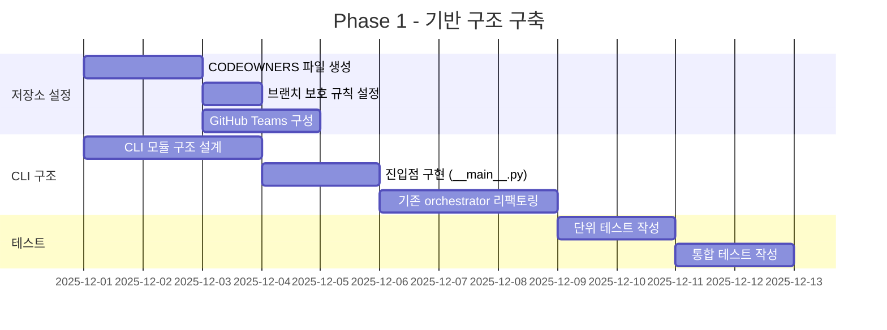

### Phase 2: CLI 명령어 구현 (3주)

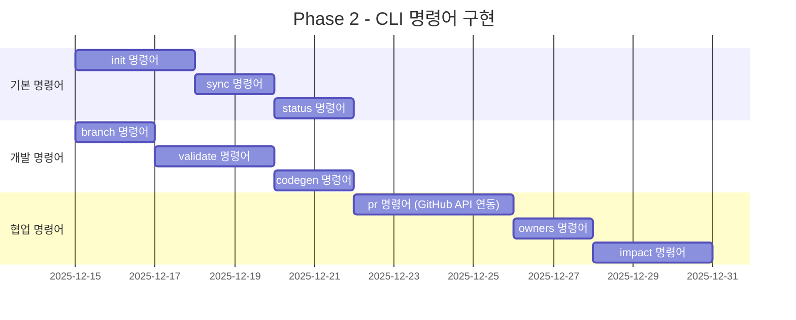

### Phase 3: CI/CD 통합 (2주)

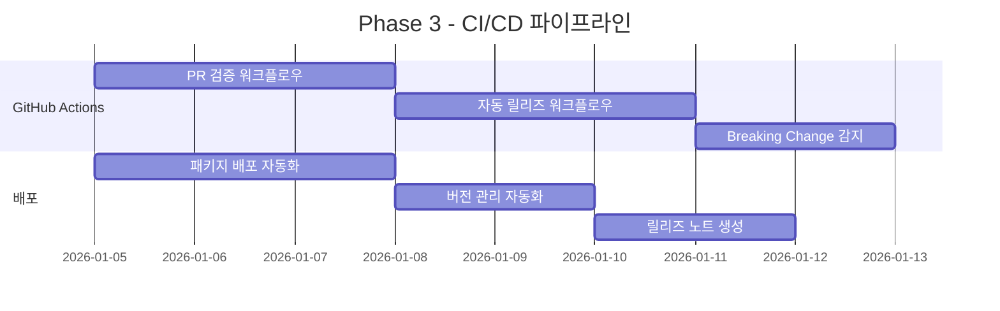

### Phase 4: 문서화 및 마이그레이션 (1주)

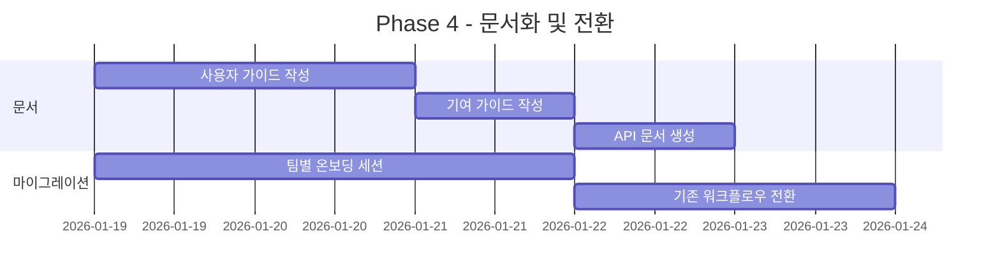

---

## 예상 효과

### 정량적 효과

| 지표                   | 현재                  | 개선 후         | 개선율       |
| ---------------------- | --------------------- | --------------- | ------------ |
| Proto 변경 리드타임    | 2-3일                 | 4-8시간         | **75% 감소** |
| 협업 커뮤니케이션 비용 | 팀간 메시징 평균 10회 | PR 코멘트 2-3회 | **70% 감소** |
| 버전 불일치 이슈       | 월 5-7건              | 월 0-1건        | **90% 감소** |
| 릴리즈 소요 시간       | 30-45분               | 5-10분 (자동화) | **80% 감소** |

### 정성적 효과

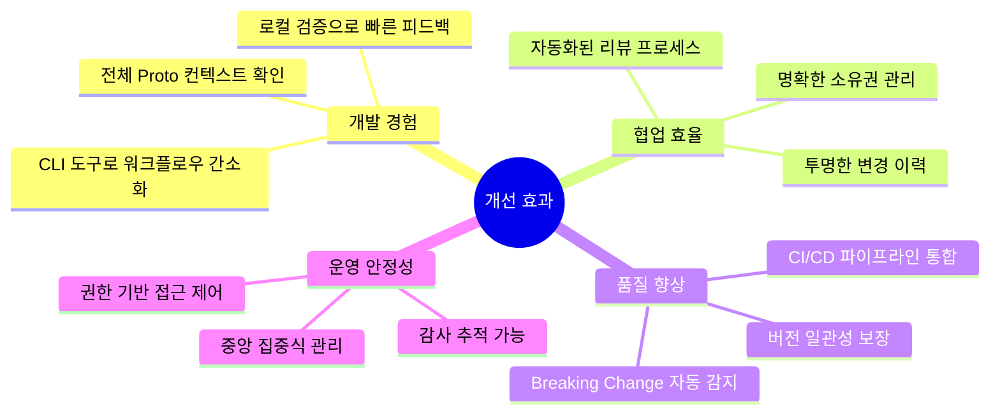

---

## 리스크 및 대응 방안

### 주요 리스크

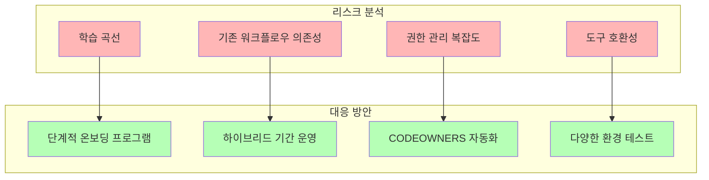

| 리스크             | 영향도 | 확률 | 대응 전략                    |
| ------------------ | ------ | ---- | ---------------------------- |
| 팀원 학습 곡선     | 중     | 높음 | 핸즈온 워크샵 + 상세 문서    |
| 기존 프로세스 저항 | 중     | 중간 | 점진적 전환 + 파일럿 팀 운영 |
| GitHub API 제한    | 낮     | 낮음 | Rate limiting 처리 + 캐싱    |
| 권한 설정 오류     | 높     | 낮음 | 자동화 테스트 + 주기적 감사  |

---

## 다음 단계

### 즉시 실행 가능한 작업

1. **Week 1**: CODEOWNERS 파일 생성 및 팀 매핑
2. **Week 2**: CLI 모듈 구조 설계 및 PoC 구현
3. **Week 3**: 파일럿 팀 선정 및 초기 테스트
4. **Week 4**: 피드백 반영 및 전체 배포 준비

### 의사결정 필요 사항

- [ ] GitHub Teams 구성 승인
- [ ] 브랜치 전략 최종 확정
- [ ] 릴리즈 주기 정의 (자동 vs 수동)
- [ ] 파일럿 팀 선정
- [ ] 마이그레이션 일정 조율

---

## 참고 자료

- [Buf Best Practices](https://buf.build/docs/best-practices)
- [GitHub CODEOWNERS](https://docs.github.com/en/repositories/managing-your-repositorys-settings-and-features/customizing-your-repository/about-code-owners)
- [Semantic Versioning](https://semver.org/)
- [Git Flow](https://nvie.com/posts/a-successful-git-branching-model/)

---

**문서 버전**: 1.0.0  
**작성일**: 2025-12-01  
**작성자**: Platform Team  
**검토 필요**: Architecture Team, DevOps Team
