# gRPC Proto 협업 워크플로우 설계

## 📋 목차

- [개요](#개요)
- [워크플로우 설계](#워크플로우-설계)
- [아키텍처 설계](#아키텍처-설계)
- [브랜치 전략](#브랜치-전략)
- [권한 관리](#권한-관리)
- [CLI 도구](#cli-도구)
- [리스크 및 대응 방안](#리스크-및-대응-방안)

---

## 개요

### 목적
각 서비스 팀이 gRPC proto 파일을 효율적으로 협업하고 관리할 수 있는 통합 워크플로우 구축

### 핵심 요구사항
1. **중앙 집중식 Proto 관리**: grpc-protos 저장소를 단일 진실 소스(Single Source of Truth)로 활용
2. **유연한 개발 환경**: 각 서비스 팀이 전체 proto 컨텍스트를 확인하며 작업
3. **역할 기반 권한**: gRPC 서버 팀은 직접 수정, 클라이언트 팀은 PR 제출
4. **CLI 도구 통합**: mysingle-protos 패키지 설치 시 proto-cli 자동 제공

---

## 워크플로우 설계

### 전체 개요

```mermaid
graph TB
    subgraph SERVICE ["서비스 개발 환경"]
        SERVICE_DIR[services/strategy-service/]
        SUBMOD[grpc-protos/ submodule]
        INIT[proto-cli init]
        
        SERVICE_DIR --> INIT
        INIT -->|자동 구성| SUBMOD
    end
    
    subgraph SUBMOD_WORK ["grpc-protos Submodule"]
        EDIT[Proto 파일 직접 수정]
        VALIDATE[proto-cli validate]
        GENERATE[proto-cli generate]
        BRANCH[feature 브랜치]
        
        EDIT --> VALIDATE
        VALIDATE --> GENERATE
        GENERATE --> BRANCH
    end
    
    subgraph GITHUB ["grpc-protos 저장소 GitHub"]
        MAIN[main 브랜치]
        DEV[dev 브랜치]
        FEAT[feature/* 브랜치들]
        
        MAIN -->|base| DEV
        DEV -->|base| FEAT
    end
    
    subgraph CICD ["CI/CD Pipeline"]
        VALIDATE_CI[검증: buf lint/breaking]
        GENERATE_CI[코드 생성]
        TAG[버전 태그 생성]
        PUBLISH[패키지 배포]
    end
    
    SUBMOD --> EDIT
    BRANCH -->|git push| FEAT
    FEAT -->|PR| DEV
    
    DEV -->|merge to main| VALIDATE_CI
    VALIDATE_CI --> GENERATE_CI
    GENERATE_CI --> TAG
    TAG --> PUBLISH
    
    PUBLISH --> PKG["mysingle-protos v2.x.x"]
    PKG -->|pip install| SERVICES[모든 서비스]
    
    style MAIN fill:#90EE90
    style DEV fill:#87CEEB
    style PKG fill:#FFD700
```

---

## 아키텍처 설계

### 1. 저장소 구조 개선

```mermaid
graph LR
    subgraph "grpc-protos Repository"
        ROOT["Repository Root"]
        
        subgraph "protos/"
            COMMON[common/]
            SERVICES[services/]
            
            subgraph "services/ 상세"
                STRAT[strategy/v1/]
                MARKET[market_data/v1/]
                INDIC[indicator/v1/]
            end
        end
        
        subgraph "scripts/"
            DEPRECATED["(deprecated 파일 제거됨)"]
        end
        
        subgraph "generated/"
            PYTHON[mysingle_protos/]
        end
        
        CONFIG[pyproject.toml]
        OWNERS[CODEOWNERS]
        
        ROOT --> protos/
        ROOT --> scripts/
        ROOT --> generated/
        ROOT --> CONFIG
        ROOT --> OWNERS
    end
    
    style OWNERS fill:#FFE4E1
    style ENTRY fill:#E1FFE4
```

### 2. 패키지 진입점 설계

```mermaid
graph TB
    subgraph "mysingle-protos 패키지 구조"
        PKG[mysingle_protos/]
        
        subgraph "생성된 코드"
            PROTOS[protos/]
            PB2[*_pb2.py]
            GRPC[*_pb2_grpc.py]
        end
        
        subgraph "CLI 도구"
            CLI_INIT[__main__.py]
            COMMANDS[commands/]
            UTILS[utils.py]
            MODELS[models.py]
        end
        
        PKG --> PROTOS
        PKG --> CLI_INIT
        PROTOS --> PB2
        PROTOS --> GRPC
        CLI_INIT --> COMMANDS
        COMMANDS --> UTILS
        COMMANDS --> MODELS
    end
    
    subgraph "사용자 환경"
        INSTALL[pip install mysingle-protos]
        CMD1[proto-cli --help]
        CMD2[python -m mysingle_protos --help]
    end
    
    INSTALL --> PKG
    PKG --> CMD1
    PKG --> CMD2
    
    style CLI_INIT fill:#90EE90
```

---

## 브랜치 전략

### Git Flow 기반 전략


### 브랜치 규칙

| 브랜치      | 용도            | 보호 규칙        | 머지 조건                       |
| ----------- | --------------- | ---------------- | ------------------------------- |
| `main`      | 프로덕션 릴리즈 | ✅ Protected      | dev에서 PR + 승인 2명 + CI 통과 |
| `dev`       | 개발 통합       | ✅ Protected      | feature에서 PR + CI 통과        |
| `feature/*` | 기능 개발       | ❌                | 개발자 자유 작업                |
| `hotfix/*`  | 긴급 수정       | ⚠️ Semi-protected | main에서 직접 분기 가능         |

---

## 권한 관리

### CODEOWNERS 기반 권한 설정

```mermaid
graph TB
    subgraph "Proto 파일 소유권"
        COMMON[protos/common/*]
        STRATEGY[protos/services/strategy/*]
        MARKET[protos/services/market_data/*]
        INDICATOR[protos/services/indicator/*]
        GENAI[protos/services/genai/*]
    end
    
    subgraph "팀 권한"
        ADMIN["team-platform-admin"]
        STRATEGY_TEAM["team-strategy"]
        MARKET_TEAM["team-market-data"]
        INDICATOR_TEAM["team-indicator"]
        GENAI_TEAM["team-genai"]
    end
    
    COMMON --> ADMIN
    STRATEGY --> STRATEGY_TEAM
    STRATEGY --> ADMIN
    MARKET --> MARKET_TEAM
    MARKET --> ADMIN
    INDICATOR --> INDICATOR_TEAM
    INDICATOR --> ADMIN
    GENAI --> GENAI_TEAM
    GENAI --> ADMIN
    
    style ADMIN fill:#FF6B6B
    style STRATEGY_TEAM fill:#4ECDC4
    style MARKET_TEAM fill:#45B7D1
```

### CODEOWNERS 예시

```plaintext
# grpc-protos/.github/CODEOWNERS

# 기본 관리자
* @team-platform-admin

# Common protos (모든 변경은 플랫폼 팀 승인 필요)
/protos/common/ @team-platform-admin

# 서비스별 소유권 (해당 팀 + 플랫폼 팀)
/protos/services/strategy/ @team-strategy @team-platform-admin
/protos/services/market_data/ @team-market-data @team-platform-admin
/protos/services/indicator/ @team-indicator @team-platform-admin
/protos/services/genai/ @team-genai @team-platform-admin
/protos/services/ml/ @team-ml @team-platform-admin
/protos/services/backtest/ @team-backtest @team-platform-admin

# Scripts 및 CI (플랫폼 팀만)
/scripts/ @team-platform-admin
/.github/ @team-platform-admin
/buf.yaml @team-platform-admin
/buf.gen.yaml @team-platform-admin
```

### 권한 매트릭스

```mermaid
graph TB
    subgraph "역할별 권한"
        direction TB
        
        R1[Platform Admin]
        R2[Service Owner - gRPC Server]
        R3[Service Owner - gRPC Client Only]
        R4[External Contributor]
    end
    
    subgraph "권한 수준"
        P1[직접 Push to dev ✅]
        P2[PR 생성 및 자체 승인 ✅]
        P3[PR 생성 - 승인 필요 ⚠️]
        P4[PR 생성 - 엄격한 리뷰 ❌]
    end
    
    R1 --> P1
    R2 --> P2
    R3 --> P3
    R4 --> P4
    
    style R1 fill:#FF6B6B
    style R2 fill:#4ECDC4
    style R3 fill:#95E1D3
    style R4 fill:#F38181
```

## CLI 도구

### 워크플로우 변화

```mermaid
graph LR
    subgraph OLD ["이전 방식"]
        REPO1[grpc-protos 중앙 저장소]
        SERVICE1[service/protos/]
        SYNC[proto-cli sync]
        
        SERVICE1 -->|복사| SYNC
        SYNC -->|업데이트| REPO1
    end
    
    subgraph NEW ["현재 방식"]
        SERVICE2[services/strategy-service/]
        SUBMOD[grpc-protos/ submodule]
        INIT[proto-cli init]
        DIRECT[직접 수정]
        
        SERVICE2 -->|자동 구성| INIT
        INIT --> SUBMOD
        SUBMOD --> DIRECT
    end
    
    style REPO1 fill:#ffcccc
    style SYNC fill:#ffcccc
    style INIT fill:#90EE90
    style DIRECT fill:#90EE90
```

### CLI 명령어

```mermaid
graph TB
    CLI[proto-cli]
    
    subgraph SETUP ["환경 설정"]
        INIT[init - grpc-protos submodule 자동 구성]
        STATUS[status - Proto 파일 현황 확인]
    end
    
    subgraph DEV ["개발 작업"]
        VALIDATE[validate - 로컬 검증]
        GENERATE[generate - Python 스텁 생성]
    end
    
    CLI --> INIT
    CLI --> STATUS
    CLI --> VALIDATE
    CLI --> GENERATE
    
    style CLI fill:#FFD700
    style INIT fill:#90EE90
```

### CLI 구조

```
mysingle_protos/
├── protos/                      # 생성된 proto 코드
│   ├── common/
│   └── services/
├── cli/                         # CLI 모듈
│   ├── __init__.py
│   ├── __main__.py             # 진입점
│   ├── utils.py                # 유틸리티 (colorize, log 등)
│   ├── models.py               # ProtoConfig, ServiceProtoInfo
│   └── commands/
│       ├── init.py             # Submodule 자동 구성
│       ├── status.py           # Proto 현황 확인
│       ├── validate.py         # Buf 검증
│       └── generate.py         # 코드 생성
└── __init__.py
```

### 명령어 상세

#### `proto-cli init`
- **grpc-protos 저장소 내부**: 환경 확인 (Git, Buf, 디렉토리)
- **서비스 디렉토리**: Submodule 자동 구성
  - `git submodule add https://github.com/Br0therDan/grpc-protos.git`
  - `git submodule update --init --recursive`
  - dev 브랜치로 자동 체크아웃
  - 사용 가이드 출력

#### `proto-cli status`
- Proto 파일 현황 테이블 출력
- 서비스별 파일 개수 및 최근 수정일
- `-v` 옵션: 상세 파일 목록

#### `proto-cli validate`
- Buf lint 검사
- Buf format 검사 (`--fix`로 자동 수정)
- Breaking change 검사 (`--breaking`)

#### `proto-cli generate`
- Buf를 사용한 Python 스텁 생성
- Import 경로 자동 수정

---

### 사용 시나리오

#### 시나리오 1: gRPC 서버 팀의 Proto 업데이트

```mermaid
sequenceDiagram
    participant Dev as 개발자
    participant CLI as proto-cli
    participant Local as 로컬 grpc-protos
    participant Remote as GitHub grpc-protos
    participant CI as GitHub Actions
    
    Dev->>CLI: proto-cli init
    CLI->>Remote: git clone
    Remote-->>Local: 저장소 복제
    
    Dev->>CLI: proto-cli branch feature/add-new-field
    CLI->>Local: git checkout -b feature/add-new-field
    
    Dev->>Local: proto 파일 수정
    
    Dev->>CLI: proto-cli validate
    CLI->>Local: buf lint & breaking
    CLI-->>Dev: ✅ 검증 통과
    
    Dev->>CLI: proto-cli push
    Note over CLI,Remote: 서버 팀 권한 확인
    CLI->>Remote: git push origin feature/add-new-field
    
    Dev->>CLI: proto-cli pr --auto-merge
    CLI->>Remote: GitHub API - Create PR to dev
    Remote->>CI: 트리거 CI/CD
    CI-->>Remote: ✅ 검증 완료
    Remote->>Remote: Auto-merge to dev (팀 권한)
    
    Note over Dev: dev 브랜치에 변경사항 병합 완료
```

#### 시나리오 2: gRPC 클라이언트 팀의 변경 요청

```mermaid
sequenceDiagram
    participant Client as 클라이언트 팀
    participant CLI as proto-cli
    participant Local as 로컬 grpc-protos
    participant Remote as GitHub grpc-protos
    participant Server as 서버 팀
    participant CI as GitHub Actions
    
    Client->>CLI: proto-cli init
    CLI->>Remote: git clone
    Remote-->>Local: 저장소 복제
    
    Client->>CLI: proto-cli branch feature/request-new-endpoint
    CLI->>Local: git checkout -b feature/request-new-endpoint
    
    Client->>Local: proto 파일 수정 제안
    
    Client->>CLI: proto-cli validate
    CLI->>Local: buf lint & breaking
    CLI-->>Client: ✅ 검증 통과
    
    Client->>CLI: proto-cli pr --draft
    Note over CLI,Remote: 클라이언트 팀 - PR만 가능
    CLI->>Remote: GitHub API - Create Draft PR
    CLI->>Remote: @team-strategy 리뷰 요청
    
    Remote->>Server: 📧 리뷰 요청 알림
    Server->>Remote: 리뷰 및 승인
    Remote->>CI: 트리거 CI/CD
    CI-->>Remote: ✅ 검증 완료
    Server->>Remote: Merge PR to dev
    
    Note over Client: 서버 팀 승인 후 dev에 병합 완료
```

---

## 워크플로우 상세 설계

### 전체 프로세스

```mermaid
flowchart TB
    START([개발자 시작])
    
    subgraph SETUP [" 환경 설정"]
        INSTALL[pip install mysingle-protos]
        INIT[proto-cli init]
        CLONE{저장소 존재?}
        GIT_CLONE[git clone grpc-protos]
        GIT_PULL[git pull origin dev]
    end
    
    subgraph DEVELOP [" 개발 작업"]
        CREATE_BRANCH[proto-cli branch feature/xxx]
        EDIT_PROTO[proto 파일 수정]
        VALIDATE_LOCAL[proto-cli validate]
        VALID{검증 통과?}
    end
    
    subgraph SUBMIT [" 제출 프로세스"]
        CHECK_PERM{권한 확인}
        DIRECT_PUSH[proto-cli push --to-dev]
        CREATE_PR[proto-cli pr create]
        DRAFT{Draft PR?}
        REQUEST_REVIEW[리뷰어 지정]
    end
    
    subgraph REVIEW [" 리뷰 프로세스"]
        AWAIT_REVIEW[리뷰 대기]
        CI_CHECK[CI/CD 검증]
        REVIEWER_CHECK[리뷰어 승인]
        APPROVED{승인?}
    end
    
    subgraph MERGE [" 병합 프로세스"]
        MERGE_DEV[dev 브랜치 병합]
        AUTO_VERSION[자동 버전 증가]
        WAIT_RELEASE[릴리즈 대기]
        MANUAL_RELEASE{수동 릴리즈?}
        RELEASE_CMD[proto-cli release --version x.y.z]
        AUTO_RELEASE[main 병합 시 자동 릴리즈]
    end
    
    subgraph PUBLISH [" 배포"]
        GEN_CODE[Python stub 생성]
        RUN_TESTS[테스트 실행]
        CREATE_TAG[Git 태그 생성]
        PUBLISH_PKG[PyPI/GitHub Release 배포]
    end
    
    END([완료])
    
    START --> INSTALL
    INSTALL --> INIT
    INIT --> CLONE
    CLONE -->|No| GIT_CLONE
    CLONE -->|Yes| GIT_PULL
    GIT_CLONE --> CREATE_BRANCH
    GIT_PULL --> CREATE_BRANCH
    
    CREATE_BRANCH --> EDIT_PROTO
    EDIT_PROTO --> VALIDATE_LOCAL
    VALIDATE_LOCAL --> VALID
    VALID -->|Fail| EDIT_PROTO
    VALID -->|Pass| CHECK_PERM
    
    CHECK_PERM -->|Server Team| DIRECT_PUSH
    CHECK_PERM -->|Client Team| CREATE_PR
    DIRECT_PUSH --> MERGE_DEV
    CREATE_PR --> DRAFT
    DRAFT -->|Yes| REQUEST_REVIEW
    DRAFT -->|No| REQUEST_REVIEW
    
    REQUEST_REVIEW --> AWAIT_REVIEW
    AWAIT_REVIEW --> CI_CHECK
    CI_CHECK --> REVIEWER_CHECK
    REVIEWER_CHECK --> APPROVED
    APPROVED -->|No| EDIT_PROTO
    APPROVED -->|Yes| MERGE_DEV
    
    MERGE_DEV --> AUTO_VERSION
    AUTO_VERSION --> WAIT_RELEASE
    WAIT_RELEASE --> MANUAL_RELEASE
    MANUAL_RELEASE -->|Yes| RELEASE_CMD
    MANUAL_RELEASE -->|No| AUTO_RELEASE
    
    RELEASE_CMD --> GEN_CODE
    AUTO_RELEASE --> GEN_CODE
    GEN_CODE --> RUN_TESTS
    RUN_TESTS --> CREATE_TAG
    CREATE_TAG --> PUBLISH_PKG
    PUBLISH_PKG --> END
    
    style START fill:#90EE90
    style END fill:#FFD700
    style DIRECT_PUSH fill:#FF6B6B
    style CREATE_PR fill:#87CEEB
```

---

## 리스크 및 대응 방안

### 주요 리스크

```mermaid
graph TB
    subgraph "리스크 분석"
        R1[학습 곡선]
        R2[기존 워크플로우 의존성]
        R3[권한 관리 복잡도]
        R4[도구 호환성]
    end
    
    subgraph "대응 방안"
        M1[단계적 온보딩 프로그램]
        M2[하이브리드 기간 운영]
        M3[CODEOWNERS 자동화]
        M4[다양한 환경 테스트]
    end
    
    R1 --> M1
    R2 --> M2
    R3 --> M3
    R4 --> M4
    
    style R1 fill:#FFB6B6
    style R2 fill:#FFB6B6
    style R3 fill:#FFB6B6
    style R4 fill:#FFB6B6
    style M1 fill:#B6FFB6
    style M2 fill:#B6FFB6
    style M3 fill:#B6FFB6
    style M4 fill:#B6FFB6
```

| 리스크             | 영향도 | 확률 | 대응 전략                    |
| ------------------ | ------ | ---- | ---------------------------- |
| 팀원 학습 곡선     | 중     | 높음 | 핸즈온 워크샵 + 상세 문서    |
| 기존 프로세스 저항 | 중     | 중간 | 점진적 전환 + 파일럿 팀 운영 |
| GitHub API 제한    | 낮     | 낮음 | Rate limiting 처리 + 캐싱    |
| 권한 설정 오류     | 높     | 낮음 | 자동화 테스트 + 주기적 감사  |

---

## 참고 자료

- [Buf Best Practices](https://buf.build/docs/best-practices)
- [GitHub CODEOWNERS](https://docs.github.com/en/repositories/managing-your-repositorys-settings-and-features/customizing-your-repository/about-code-owners)
- [Semantic Versioning](https://semver.org/)
- [Git Flow](https://nvie.com/posts/a-successful-git-branching-model/)

---

**문서 버전**: 2.0.0  
**작성일**: 2025-12-01  
**최종 수정**: 2025-12-01  
**작성자**: Platform Team
